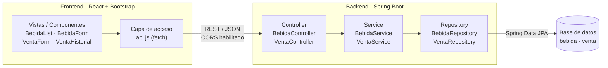
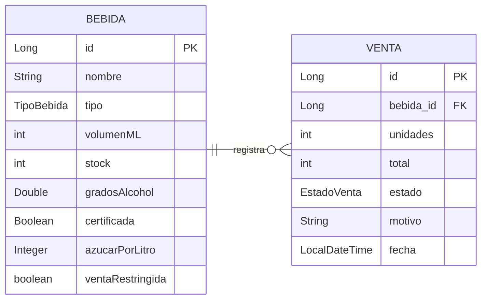

# Tarea Fiestas Patrias — Fonda San Belarmino

**DSY1104 · Desarrollo Full Stack II · EA3: Integración y Comunicación REST**

> Material de práctica. No corresponde a una evaluación sumativa.

| | |
|---|---|
| **Sigla** | DSY1104 |
| **Experiencia de aprendizaje** | EA3: Integración y Comunicación REST |
| **Indicadores de logro** | IL 3.1 e IL 3.2 |
| **Tiempo estimado** | 1 semana |
| **Modalidad** | Grupal, hasta 3 estudiantes por equipo |
| **Stack** | React + Bootstrap · Spring Boot · Spring Data JPA · MySQL |

---

## Cómo trabajar con este repositorio

El repositorio contiene **dos proyectos separados** que se comunican por HTTP:

```
backend/    Spring Boot + Spring Data JPA  →  http://localhost:8080
frontend/   React + Vite + Bootstrap       →  http://localhost:5173
```

1. Un integrante del equipo pulsa **Fork** para crear el repositorio en su cuenta; el resto trabaja sobre ese fork como colaboradores.
2. Clonen el repositorio:
   ```bash
   git clone https://github.com/USUARIO_DEL_EQUIPO/fonda-san-belarmino.git
   cd fonda-san-belarmino
   ```
3. Levanten el backend, en una terminal:
   ```bash
   cd backend
   mvn spring-boot:run
   ```
4. Levanten el frontend, en otra terminal:
   ```bash
   cd frontend
   npm install
   npm run dev
   ```
5. Abran `http://localhost:5173` para la interfaz y `http://localhost:8080/api/bebidas` para la API.

Los dos procesos corren al mismo tiempo. Si cierran el backend, el frontend seguirá abierto pero no podrá cargar datos: eso es exactamente lo que el criterio de manejo de errores espera que la interfaz comunique.

### Base de datos

El backend arranca con una base **en memoria (H2)** para que puedan trabajar sin instalar nada. Los datos iniciales se cargan solos desde `data.sql` y se pierden al detener la aplicación.

Para trabajar contra **MySQL**, creen el esquema y activen el perfil:

```sql
CREATE DATABASE fonda CHARACTER SET utf8mb4;
```

```bash
cd backend
mvn spring-boot:run -Dspring-boot.run.profiles=mysql
```

Las credenciales se leen de las variables de entorno `DB_USER` y `DB_PASSWORD`. **No escriban contraseñas reales en los archivos del repositorio**: es público y cualquiera puede leerlas.

### CORS

Como frontend y backend corren en puertos distintos, el navegador bloqueará las peticiones hasta que el backend autorice el origen del frontend. El origen permitido está en `application.properties` como `fonda.cors.origen`; falta implementar la configuración que lo aplica.

### Verificar la API antes de conectar

Prueben cada endpoint con **Postman** antes de escribir el código de React. Cuando algo falla en la integración, esa prueba les dice de inmediato si el problema está en el backend o en el consumo desde el frontend.

Cada push dispara una verificación automática en GitHub Actions que compila el backend y construye el frontend.

---

## Condiciones de la actividad

### Del propósito de la actividad

- Esta tarea no tiene nota propia. Su propósito es que el equipo identifique, antes de la evaluación parcial 3, qué partes de la integración frontend-backend ya resuelve con soltura y cuáles necesita reforzar. Evalúa los indicadores IL 3.1 e IL 3.2.
- Pueden consultar sus apuntes, el material de la asignatura, la documentación oficial de Spring Boot y React, y al docente durante toda la sesión.
- El trabajo es en equipo, pero cada integrante debe poder explicar cualquier parte de la solución. Repartan el trabajo por capas y roten, en lugar de que una sola persona vea el backend completo.
- Avancen por capas: primero el modelo y la persistencia, luego los servicios, después los controladores, y al final el frontend. Si no alcanzan a completar todo, entreguen igualmente lo que lograron.
- Si la aplicación no levanta, no la descarten. Guarden el error de arranque y consúltenlo: interpretar una traza de Spring Boot es parte del objetivo de la actividad.

### De su solución

- El código debe respetar la separación en capas y las convenciones de Java: `PascalCase` para clases, `camelCase` para métodos y atributos, y un paquete por responsabilidad.
- Pueden crear clases auxiliares, DTO, componentes o métodos adicionales siempre que no contradigan los requerimientos del caso.
- Pueden usar herramientas de inteligencia artificial y cualquier otro recurso disponible, siempre que sean capaces de explicarle al docente qué hace cada parte del código que entregan. Si no pueden explicarlo, ese código no evidencia aprendizaje.
- Esta tarea no se califica con nota. Lo que se registra es el nivel alcanzado en cada criterio de la rúbrica, para orientar el trabajo de las próximas sesiones.

---

## 1. Contexto del caso

La Fonda San Belarmino necesita llevar a la web el control de las bebidas que ofrece durante las Fiestas Patrias. Hoy el registro se lleva en papel y no permite consultar el stock ni el historial de ventas desde más de un puesto a la vez. Se requiere un backend en Spring Boot con conexión a base de datos que administre el catálogo de bebidas y registre cada venta, y un frontend en React que consuma esa API mediante comunicación REST para operar desde el navegador.

Frontend y backend son dos proyectos separados que se comunican por HTTP, por lo que el backend debe habilitar CORS para el origen del frontend. El sistema debe respetar las reglas de precio de cada tipo de bebida y el control de consumo responsable que la fonda aplica a las bebidas alcohólicas, y debe responder con los códigos de estado HTTP que correspondan a cada situación.

### Arquitectura de la solución



### Modelo de datos



---

## 2. Modelo de datos y arquitectura

Cada capa tiene una única responsabilidad y solo conversa con la capa inmediatamente siguiente: **el controlador no accede al repositorio y el repositorio no contiene reglas de negocio**. Las entidades se mapean con JPA y el acceso a datos se resuelve con interfaces de Spring Data, sin escribir SQL salvo que una consulta lo requiera.

- La entidad **`Bebida`** guarda nombre, tipo, volumen en mililitros, stock y el indicador de venta restringida. Los atributos propios de cada tipo (grados de alcohol y certificación para las alcohólicas, contenido de azúcar para las sin alcohol) admiten valor nulo, porque solo aplican a uno de los dos tipos. El tipo se modela como enumeración, nunca como texto libre.
- La entidad **`Venta`** guarda la bebida vendida, las unidades, el total cobrado, el estado de la operación y el motivo del rechazo cuando corresponda. Se relaciona con `Bebida` mediante una asociación de muchos a uno.
- La capa de **servicio** concentra las reglas de negocio: calcula el precio, verifica el control de consumo, descuenta el stock y decide si una venta se autoriza o se rechaza. Es la única capa que conoce esas reglas.
- La capa de **controlador** expone la API REST, traduce el resultado del servicio al código de estado HTTP correspondiente, habilita CORS para el frontend y no contiene lógica de negocio.

---

## 3. Reglas de negocio

El precio de venta de una bebida depende de su tipo y de sus atributos propios. El servicio debe calcularlo al momento de exponer la bebida y al registrar una venta:

- **Bebida alcohólica:** el precio base es $3.500. Si la bebida no cuenta con certificación del proveedor, ese precio se incrementa en un 20%.
- **Bebida sin alcohol:** el precio base es $2.000. Si el contenido de azúcar supera los 80 g/L, el precio se incrementa en un 10%.

El registro de una venta debe aplicar las siguientes verificaciones, en este orden, y detenerse en la primera que falle:

1. Si la bebida tiene la venta restringida, la venta se rechaza. La respuesta es `409 Conflict` con el motivo `VENTA_RESTRINGIDA`.
2. Si la bebida es alcohólica y las unidades solicitadas superan el máximo por cliente, la venta se rechaza. La respuesta es `409 Conflict` con el motivo `LIMITE_EXCEDIDO`.
3. Si el stock disponible es menor que las unidades solicitadas, la venta se rechaza. La respuesta es `409 Conflict` con el motivo `STOCK_INSUFICIENTE`.
4. Si ninguna verificación falla, la venta se autoriza: se descuenta el stock, se calcula el total como precio unitario por unidades y se persiste la venta. La respuesta es `201 Created` con la cabecera `Location` apuntando al recurso creado.

El máximo de unidades por cliente es el mismo para todas las bebidas alcohólicas (3 unidades) y no cambia durante la ejecución. Ya está declarado como la propiedad `fonda.limite-unidades-por-cliente` en `application.properties`: léanlo desde ahí y no repitan el número en el código. Las bebidas sin alcohol no están sujetas a este límite.

---

## 4. Validaciones esperadas

Las validaciones de entrada deben declararse con anotaciones de Bean Validation sobre el objeto que recibe el controlador y activarse con `@Valid`. Cuando una validación falle, la API debe responder **`400 Bad Request`** con un cuerpo que indique, campo por campo, el motivo del rechazo. Un manejador global de excepciones debe centralizar esa traducción: ningún controlador arma respuestas de error por su cuenta.

| Campo | Regla |
|---|---|
| `nombre` | No puede ser nulo ni vacío. |
| `volumenML` | Debe encontrarse en el rango entre 100 y 3.000 mililitros. |
| `stock` | Debe ser un valor mayor o igual a cero. |
| `gradosAlcohol` | Obligatorio y entre 0,5 y 45 cuando el tipo es `ALCOHOLICA`; debe quedar nulo en el otro tipo. |
| `azucarPorLitro` | Obligatorio y mayor o igual a cero cuando el tipo es `SIN_ALCOHOL`; debe quedar nulo en el otro tipo. |

---

## 5. Endpoints de la API REST

La API se publica bajo el prefijo `/api`. Cada operación responde con el código de estado que corresponde a su resultado, no siempre `200`:

| Método | Ruta | Descripción | Respuestas |
|---|---|---|---|
| `GET` | `/api/bebidas` | Lista el catálogo. Admite `?nombre=` para filtrar. | `200` |
| `GET` | `/api/bebidas/{id}` | Entrega una bebida por su identificador. | `200` · `404` |
| `POST` | `/api/bebidas` | Crea una bebida. | `201` + `Location` · `400` |
| `PUT` | `/api/bebidas/{id}` | Actualiza una bebida existente. | `200` · `400` · `404` |
| `DELETE` | `/api/bebidas/{id}` | Elimina una bebida. | `204` · `404` |
| `PATCH` | `/api/bebidas/{id}/restriccion` | Marca la bebida como de venta restringida. | `200` · `404` |
| `POST` | `/api/ventas` | Registra una venta (bebida + unidades). | `201` · `409` · `404` |
| `GET` | `/api/ventas` | Historial de ventas, incluidas las rechazadas. | `200` |

---

## 6. Requerimientos del frontend

El frontend es un proyecto React independiente, construido con componentes y estilado con Bootstrap, que consume la API por REST. No debe contener reglas de negocio: todo cálculo y toda decisión provienen del backend. Debe permitir:

- Listar el catálogo de bebidas en un componente de tabla que muestre nombre, tipo, volumen, stock, precio calculado y estado de restricción.
- Filtrar el listado por nombre usando el parámetro que expone la API, sin filtrar en el navegador.
- Crear, actualizar y eliminar bebidas desde la interfaz, cubriendo las cuatro operaciones CRUD contra la API y mostrando los mensajes de error campo por campo cuando la respuesta sea `400`.
- Registrar una venta indicando bebida y unidades, mostrando el total cobrado cuando se autoriza y el motivo devuelto por la API cuando se rechaza.
- Mostrar el historial de ventas con su estado y, en las rechazadas, el motivo informado por la API.
- Informar al usuario mientras una petición está en curso y cuando falla, sin dejar la pantalla en blanco ni mostrar la excepción cruda.

---

## 7. Resultado esperado

### Datos iniciales de la base de datos

| Tipo | Nombre | Volumen (ml) | Stock | Atributo específico |
|---|---|---|---|---|
| `ALCOHOLICA` | Chicha | 1000 | 40 | Grados: 12.0 · Certificada: false · Venta: Restringida |
| `ALCOHOLICA` | Pisco Sour | 500 | 25 | Grados: 18.0 · Certificada: true |
| `SIN_ALCOHOL` | Chicha | 1000 | 60 | Azúcar: 95 g/L |
| `SIN_ALCOHOL` | Mote con Huesillo | 400 | 50 | Azúcar: 70 g/L |

Con esos datos cargados, la API debe responder de forma equivalente a lo siguiente:

```bash
$ curl -s "http://localhost:8080/api/bebidas?nombre=Chicha"
[
  { "id": 1, "nombre": "Chicha", "tipo": "ALCOHOLICA", "volumenML": 1000,
    "stock": 40, "gradosAlcohol": 12.0, "certificada": false,
    "ventaRestringida": true, "precio": 4200 },
  { "id": 3, "nombre": "Chicha", "tipo": "SIN_ALCOHOL", "volumenML": 1000,
    "stock": 60, "azucarPorLitro": 95, "precio": 2200 }
]
```

```bash
$ curl -s -i -X POST http://localhost:8080/api/ventas \
       -H "Content-Type: application/json" \
       -d '{"bebidaId": 2, "unidades": 2}'
HTTP/1.1 201 Created
Location: /api/ventas/1
{ "id": 1, "bebidaId": 2, "nombre": "Pisco Sour", "unidades": 2,
  "total": 7000, "estado": "AUTORIZADA" }
```

```bash
$ curl -s -i -X POST http://localhost:8080/api/ventas \
       -d '{"bebidaId": 2, "unidades": 5}'
HTTP/1.1 409 Conflict
{ "error": "LIMITE_EXCEDIDO",
  "mensaje": "5 unidades superan el limite de 3 por cliente." }
```

```bash
$ curl -s -i -X POST http://localhost:8080/api/bebidas \
       -d '{"nombre": "", "volumenML": 50, "stock": 0}'
HTTP/1.1 400 Bad Request
{ "error": "VALIDACION",
  "campos": { "nombre": "no puede estar vacio",
              "volumenML": "debe estar entre 100 y 3000",
              "stock": "debe ser mayor o igual a cero" } }
```

Se aceptan diferencias en los nombres de los campos del JSON y en el texto de los mensajes, siempre que se entreguen todos los datos solicitados, los cálculos sean correctos y los códigos de estado HTTP coincidan con los indicados.

---

## Entrega y retroalimentación

- Suban el proyecto completo a un repositorio público en GitHub, sin la carpeta `target`, sin `node_modules` y sin credenciales reales.
- El repositorio debe mostrar commits de todos los integrantes del equipo durante la semana de trabajo, no una sola carga al final.
- Entreguen el enlace del repositorio en la actividad habilitada en AVA al cierre de la semana, aunque la solución esté incompleta.
- Antes de entregar, revisen la solución con la rúbrica de retroalimentación y marquen en qué nivel creen estar en cada criterio de los dos bloques: frontend, y backend con base de datos.
- Prepárense para explicarle al docente cualquier parte de la solución. La retroalimentación se entrega criterio por criterio y sirve de preparación directa para la evaluación parcial 3.

---

## Estructura del proyecto

```
fonda-san-belarmino/
├── .github/workflows/build.yml
├── backend/
│   ├── pom.xml
│   └── src/main/
│       ├── java/cl/dsy1104/fonda/
│       │   ├── FondaApplication.java   (ya incluido)
│       │   ├── model/                  ← Bebida, Venta, TipoBebida, EstadoVenta
│       │   ├── repository/             ← BebidaRepository, VentaRepository
│       │   ├── service/                ← BebidaService, VentaService
│       │   ├── controller/             ← BebidaController, VentaController
│       │   ├── dto/                    ← objetos de entrada y salida
│       │   ├── config/                 ← configuración de CORS
│       │   └── exception/              ← manejador global de errores
│       └── resources/
│           ├── application.properties          (perfil por defecto, H2)
│           ├── application-mysql.properties    (perfil mysql)
│           └── data.sql                        (datos iniciales)
├── frontend/
│   ├── package.json
│   ├── vite.config.js
│   ├── .env.example
│   ├── index.html
│   └── src/
│       ├── main.jsx
│       ├── App.jsx                     (ya incluido)
│       ├── components/                 ← BebidaList, BebidaForm, VentaForm, VentaHistorial
│       └── services/api.js             (esqueleto incluido)
├── .gitignore
├── LICENSE
└── README.md
```

---

## Licencia

Material docente publicado bajo [CC BY-NC-SA 4.0](https://creativecommons.org/licenses/by-nc-sa/4.0/deed.es). El código que escriban en su fork es suyo y no queda cubierto por esta licencia.
